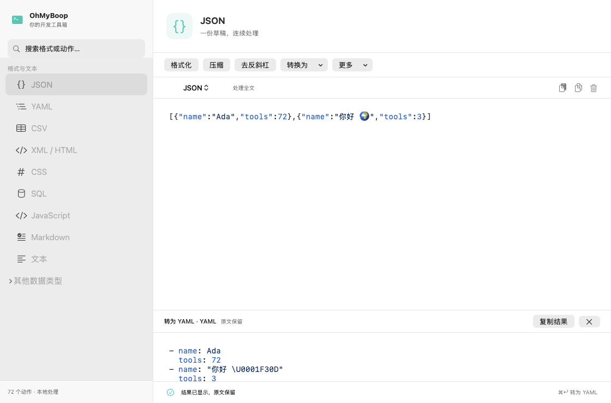
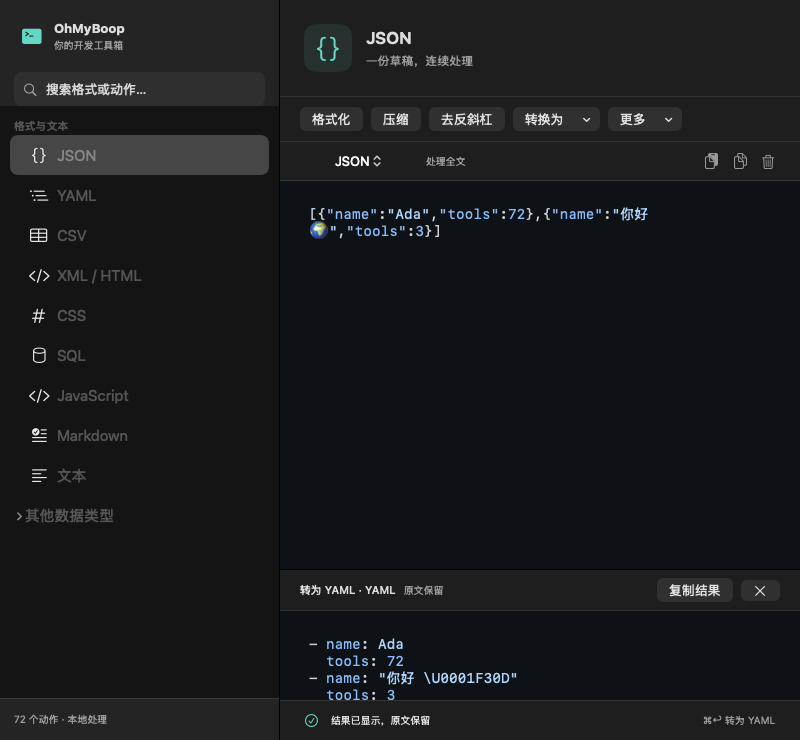

# 按格式组织的工作区重构方案

状态：已确认并实现。使用与迁移说明见 [README](../README.md)。

## 核心交互

左侧选择“处理什么”，右侧选择“怎么处理”。例如左侧只有一个 JSON 入口；进入后在同一份文本上连续点击格式化、压缩、去反斜杠等操作，撤销历史也连续保留。取消右下角单一“执行”按钮：点击动作按钮直接执行，菜单按钮只展开选项。

推荐右侧编辑区上方采用“常用动作工具条 + 分类下拉菜单”。常用动作直接可见，低频操作放进菜单；窄窗口溢出的按钮收到“更多”。不额外占用编辑器右侧空间。原有复制、粘贴、清空收进编辑区工具行，保留快捷键、选区提示与底部执行反馈。

## 左侧导航与动作归属

以明确配置替换当前通过脚本 ID 字符串猜分类的逻辑。以下是现有能力的拟归属，不表示新增对应的解析器或功能。

| 左侧入口 | 常用动作 | 菜单中的动作 |
|---|---|---|
| JSON | 格式化、压缩、去反斜杠 | 转为 YAML / CSV / URL 查询串；添加反斜杠；排序（包含数组排序） |
| YAML | 转为 JSON | 通用文本操作；目前没有独立的 YAML 格式化脚本，不先放一个空按钮 |
| CSV | 转为 JSON | 通用文本操作 |
| XML / HTML | 格式化、压缩 | HTML 实体编码 / 解码 / 全字符编码 |
| CSS | 格式化、压缩 | 通用文本操作 |
| SQL | 格式化、压缩 | 通用文本操作 |
| JavaScript | 运行 | 通用文本操作；保留现有脚本执行隔离与超时 |
| Markdown | 引用 | 通用文本操作 |
| 文本 | 去反斜杠、修剪、去重 | 大小写与命名格式、行操作、字符/行/词统计、Lorem Ipsum |

将不属于文件格式的现有工具放在可折叠的“其他数据类型”下，仍按处理对象命名：

- URL / 查询串：编码、解码、查询串转 JSON、Defang / Refang。
- Base64：编码、解码。
- JWT：解码；输出 JSON。
- 哈希：MD5、SHA1、SHA256、SHA512；标注为哈希而非加密。
- 数字与颜色：进制转换、ASCII/Hex、Hex/RGB、求和。
- 日期与时间：日期转时间戳、转 UTC。
- 本地化：Android Strings 与 iOS Localizables 互转。
- PHP 序列化：转 JSON。
- Shell：Fish PATH 转义。

Rot13 放在文本的编码菜单；Test Script 放在开发工具入口，不作为常用生产动作展示。实施时为全部 72 个脚本建立覆盖表并测试没有遗漏；通用动作可在多个工作区复用同一个 action ID。

搜索继续同时匹配格式与动作。搜索“去反斜杠”时展示“JSON › 去反斜杠”“文本 › 去反斜杠”；点击只定位工作区并突出动作，不自动修改文本。默认不保留旧的“全部功能 / 收藏”分段切换；原收藏保留为相关工作区菜单中的“已收藏动作”，后续可支持固定到工具条。

## 编辑状态与执行规则

1. **每个格式一份活动草稿。** JSON 中切换动作不会切换文本；切到 YAML 后有另一份草稿，返回 JSON 恢复原来的文本、选区、滚动、撤销与高亮偏好。
2. **动作明确处理范围。** 保留已有选区能力；有选区时显示“处理选区 · N 字符”。全文专用动作（现有 ASCII/Hex 和本地化转换等）明确显示“处理全文”。不在这次 UI 重构中悄悄改变脚本范围语义。
3. **修改操作原位执行，可撤销。** 格式化、压缩、去反斜杠等每次执行是一条撤销记录，失败保留原文；执行期间防止重复提交。
4. **转换操作展示结果。** JSON → YAML / CSV 等在编辑区下方打开可收起的结果区，显示目标格式，支持复制和关闭。第一版不自动跳转、不覆盖目标工作区草稿；需要继续加工时可复制到对应工作区。
5. **统计只反馈结果。** 字数等操作显示在状态区，不替换正文。哈希结果也优先进入结果区。
6. **语言跟随内容。** JSON/YAML/JavaScript 工作区默认使用对应高亮，转换结果按输出格式高亮；其他入口当前保持纯文本，导航分类不代表已接入这些语言的 Tree-sitter 语法。
7. **快捷键。** ⌘Z/⇧⌘Z 继续撤销/重做；⌘↩ 执行当前工作区最近一次动作，界面明确显示对应动作名，首次使用默认执行该工作区主动作。转换菜单本身不作为可执行动作。

## 两个需要准确命名的动作

- `RemoveSlashes` 是通用删除反斜杠，现有逻辑会把 `\\n` 变成字母 n，不能命名为“解析 JSON 字符串”。第一版按“去反斜杠”保留行为；如要解析字符串形式的 JSON，应另加“解析 JSON 字符串”动作，按 JSON 转义语义处理。
- `SortJSON` 既排序对象键，也排序数组元素。不能直接显示成“键排序”。保留为“排序（含数组）”，放进更多菜单；如果需要只排序键、保持数组顺序，应作为另一个明确动作实现。

## 旧草稿迁移

现状是每个工具一份草稿，例如 FormatJSON、MinifyJSON、SortJSON 可能各有内容，不能直接合并后覆盖。

- 新存储版本保留每个旧工具草稿及其来源 ID，按新格式归档。
- 当前选中工具的草稿优先作为所属格式的活动草稿；没有当前项则优先非空主动作草稿，再按固定规则选择非空草稿。旧格式没有时间字段，不能假定哪一份“最新”。
- 其余旧草稿从编辑区的“历史草稿”入口访问；恢复前先保留当前活动草稿，不静默覆盖。
- 保留迁移前存储备份；迁移失败继续读旧数据且不覆写。旧收藏映射为动作收藏。
- 本次无需引入通用多文件标签系统，但存储层应允许格式下保留多个归档草稿。

## 实现边界

- 保留 72 个脚本及 ScriptEngine 的执行接口。
- 新增格式定义与动作配置：稳定 ID、输入/输出格式、作用范围、结果类型、工具条排序和菜单分组。
- 将当前 EditorSession 与工具 ID 解耦：编辑状态属于格式工作区，执行时单独传入动作 ID。不能继续用 session.id 同时充当草稿键和执行脚本名。
- ContentView 的左侧展示格式，ToolDetail 改为格式工作区视图；继续复用原生 NSTextView 和已有 Tree-sitter 引擎。结果区使用独立的只读视图与解析状态。
- 范围仅含导航、动作入口、共享编辑状态、结果展示和旧数据迁移；不把磁盘文件管理、额外语言高亮或新增转换能力混入第一版。

## 验收重点

同一 JSON 草稿连续执行去反斜杠 → 格式化 → 压缩，并逐步撤销；切换 JSON/YAML 后状态完整恢复；转换保留输入；多个旧 JSON 工具草稿全部可找回；全部脚本都有入口；搜索动作不会自动执行；长文本着色、输入法与窗口缩放不退化。

## 实现补充

- 全部 72 个脚本由 FormatCatalog 显式映射，测试验证覆盖、归属与主动作可达性。
- 除原有四个全文接口外，检查发现 Collapse 和 Test 也直接写 fullText；本次同样明确为全文动作，脚本本身保持不变。
- 转换结果使用独立的只读编辑器与视图身份，避免重复转换显示旧结果；输入变化清除旧结果。
- 系统“处理”菜单承载当前格式最近动作的 ⌘↩，编辑区底部只显示快捷键提示。
- 合并前仍需真实窗口的菜单、键盘快捷键、中文输入法、连续输入和长文本滚动验收；离屏截图及自动化测试不等于真人操作验收。

## 验证记录（2026-09-08）

- 本机 XCTest：36 项，34 通过，2 项性能基准按默认配置跳过；没有失败。新增 11 项覆盖动作完整性、迁移、备份失败保护、恢复、真实子进程的连续操作与选区输出、并发拒绝、结果视图替换。
- Xcode Release 构建通过；新包在独立暂存目录严格校验签名后替换旧包，避免遗留资源混入。
- 打包后三种语言双主题高亮自检通过；打包应用的 FormatJSON 脚本进程实际执行成功。
- 检查 1120×740 浅色及 800×740 深色的 AppKit 离屏布局。尚未进行真人输入法、菜单/快捷键、持续滚动及最低 macOS 14 的手动验收。

