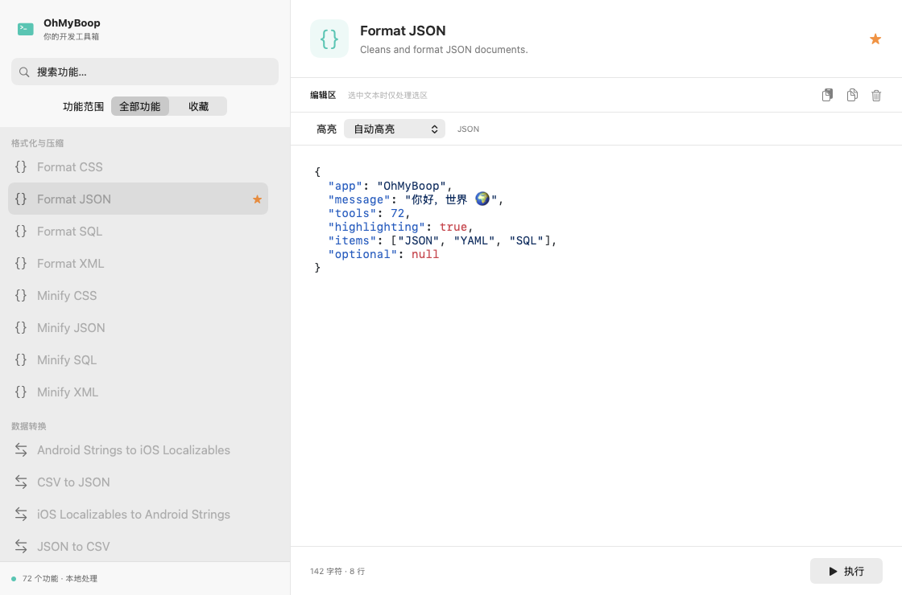
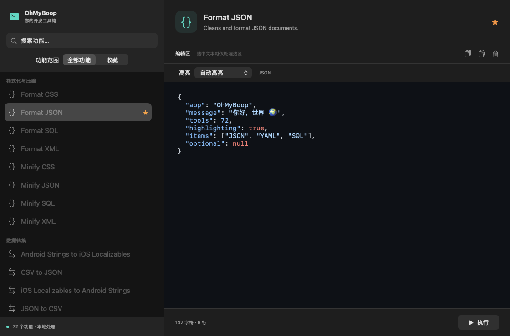

# HighlighterSwift 验证报告

日期：2026-09-08。分支：`spike/highlighterswift-validation`。本报告是技术验证结果，不是已经通过生产验收的声明。

## 结论

HighlighterSwift 3.1.0 可以接入现有 NSTextView，并在不改动正文的前提下显示多语言彩色高亮。适合作为**显式语言、小中型文本**的候选。全语言自动识别和大文档全量高亮耗时明显，因此先以 Draft PR 保留，不合并 main。

依赖固定到 3.1.0 / `fe7aae9c9b31d3b296fd3d2dd575e1a207bb29e0`，未修改上游源码。来源：[HighlighterSwift](https://github.com/smittytone/HighlighterSwift/tree/3.1.0)。

## 分支实现

- 单一 actor 持有 Highlighter 实例，隔离 JSContext，并串行执行后台任务；输入停止 180 ms 后发起着色，开始处理前跳过已取消任务。
- 回写前检查任务取消、编辑版本和输入法组合状态；过期结果不应用。
- 只将返回的前景色映射到 NSLayoutManager 临时属性，不替换 NSTextStorage 中的文本，不改变字体、选区、正文或撤销历史。
- 逐个 UTF-16 单元验证上游返回文本与输入一致，不一致或返回 nil 时回退纯文本。未使用上游的行号插入和 HTML 系统渲染路径。
- JSON、YAML、XML、CSS、SQL、JavaScript、Bash、Swift、Python、Markdown 可手动选择；支持自动和纯文本。偏好按功能独立存储，旧草稿兼容。
- 自动模式为 Format/Minify/Sort JSON 等功能提供明确提示；JSON↔YAML、Base64 等转换工具使用上游自动模式，因此不会将转换后正文继续硬编码为输入语言。混合选区的正确分类仍不能保证。
- GitHub 浅色和深色主题随系统变化。主题高亮失败不会改变正文。
- 显式语言超过 100,000 个 UTF-16 单元回退纯文本；无提示自动识别超过 8,000 个单元提示用户指定语言。这是实验性保护阈值，不是库的性能承诺。

## 本机验证

环境：Apple M2、macOS 26.6.2、Swift 6.3.3。不是最低 macOS 14 实机验证。

| 验证 | 结果 |
| --- | --- |
| `swift test` | 20 项，19 通过，1 项性能测试按设计跳过；无失败 |
| 显式语言 | 10 种样本在深浅主题下均产生多种颜色的有效范围 |
| 内容保真 | 中文、Emoji、组合字符、HTML 实体、CR/LF、未闭合内容及空字符样本经过适配器保真检查；不兼容时允许回退 |
| 编辑边界 | 选区、非零滚动位置、撤销/重做、临时属性、快速编辑、语言偏好存取测试通过 |
| 输入法 | 原生 marked text API 的组合/提交测试通过；尚未真人连续输入验收 |
| 原功能 | 全部 72 个脚本代表样本及既有持久化测试通过 |
| Xcode Release | 构建成功，签名验证成功 |
| 应用可搬移性 | 复制 `.app` 到随机临时目录，深浅主题各返回 13 个颜色范围，脚本转换也通过 |
| 界面 | 已检查下方离屏渲染图片；不等同真实窗口操作或滚动帧率验收 |

## 性能采样

执行 `OHMYBOOP_BENCHMARK=1 swift test -c release --filter HighlightingTests/testOptInPerformanceSamples`，1 项通过。人工重复的 JSON 数组；以下为单次样本，不是均值或 P95。第一次包含库/JSContext 初始化；后续复用实例。日志重定向到文件。

| 模式 | 实际 UTF-16 长度 | 耗时 | 颜色范围数 |
| --- | ---: | ---: | ---: |
| 显式 JSON，首次 | 9,975 | 131 ms | 3,421 |
| 显式 JSON，复用 | 99,995 | 828 ms | 34,285 |
| 显式 JSON，复用 | 999,985 | 12,557 ms | 342,853 |
| 自动识别，复用 | 2,600 | 500 ms | 501 |

计时包含初始化（首次）、主题准备、高亮、上游 HTML→属性串、保真检查和颜色范围提取；不包含 180 ms 防抖、actor 排队或主线程应用临时属性/绘制时间。性能采样绕过保护阈值，应用正常使用不允许该 1 MB 样本进入着色器。

实测支持限制全文自动检测并防止逐键重复全量分析，但尚不足以确认目前阈值是最佳选择。主线程属性应用成本、长行滚动、内存峰值与更多真实文件需要下一轮测量。

## 打包发现

SwiftPM 命令行构建生成的资源访问器会寻找 `Bundle.main.bundleURL` 下的资源，原来的手工 app 封装不能直接满足依赖包资源路径与签名布局。分支增加标准 `OhMyBoop.xcodeproj`，由 Xcode 生成支持 `Bundle.main.resourceURL` 的访问器，将依赖资源正确放进 Contents/Resources。

`scripts/build-app.sh` 将实验版输出到 `dist/HighlighterValidation/OhMyBoop.app`，不覆盖原来的 `dist/OhMyBoop.app`。提交项目文件、XcodeGen 配置以及 SwiftPM/Xcode 两份锁文件以保持版本一致。CI 执行测试、应用构建、签名及资源自检。

## 合并前仍需解决或明确接受

1. 上游 public API 不返回检测语言、评分、候选集。自动标签仅表示启用检测，不显示猜测语言。需要适配后才能实现候选集约束、歧义判断等设计。
2. 同步的库调用一旦开始无法被 Swift Task 中断，也没有硬超时。当前取消只阻止尚未执行或过期结果的应用，仍需验证复杂输入的最坏耗时。
3. GitHub 主题会输出上游 `WARNING MISSING STYLE ... hljs-punctuation`；标点仍有默认文本颜色，但日志噪声和样式覆盖需要处理。当前性能采样包含这些日志开销。
4. 没有引入增量分析，也没有日志、CSV、HTTP 等专用模式；不能用本轮结果认定比 Tree-sitter 更适合大文档。
5. 需最低 macOS 14、真实窗口连续输入/输入法/滚动，以及主题切换的人工验收。CI 结果应以 PR 检查状态为准。

## 复现

```sh
swift test
OHMYBOOP_BENCHMARK=1 swift test -c release --filter HighlightingTests/testOptInPerformanceSamples
zsh scripts/build-app.sh
dist/HighlighterValidation/OhMyBoop.app/Contents/MacOS/OhMyBoop --validate-highlighter /tmp/highlighter-report.json
open dist/HighlighterValidation/OhMyBoop.app
```

## 界面预览

以下来自测试中的原生视图离屏渲染，内容是固定测试样本。




