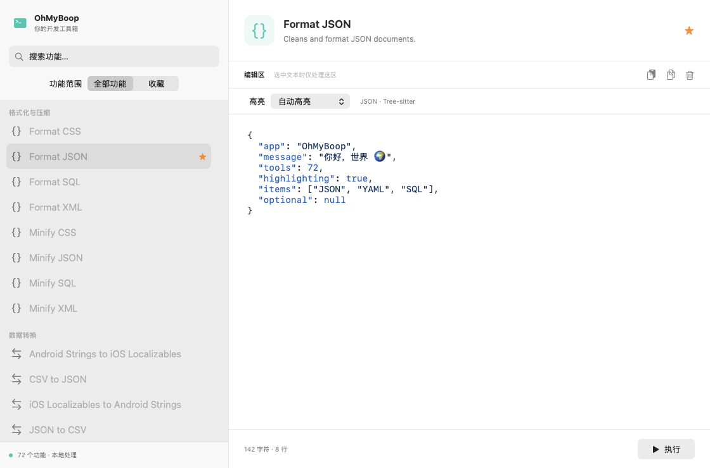
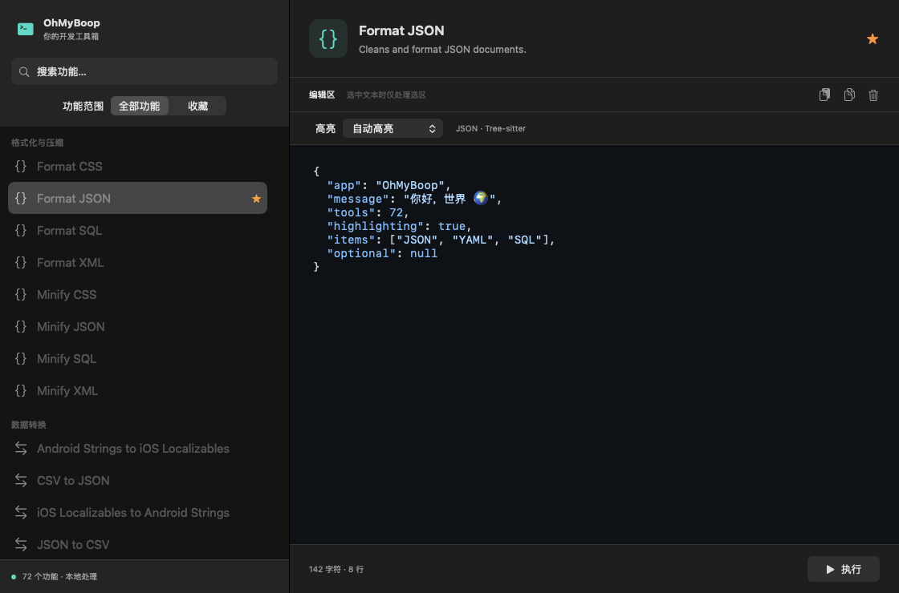

# Tree-sitter 验证

分支：`spike/tree-sitter-validation`。基于 HighlighterSwift 验证提交 `ded5d3f` 保留相同的原生编辑器、脚本测试和性能样本；替换高亮引擎。本分支是与 PR #1 并列的候选方案，尚未合并 main。

## 结果

Tree-sitter 值得作为明确语言的编辑场景继续推进。约 10 万 UTF-16 单元 JSON 的完整后台高亮为 76.27 ms，HighlighterSwift 基线为 828.45 ms；增量解析只需 0.87 ms，但完整查询、排序和颜色转换仍使单次更新达到 66.32 ms。因此本验证证明了增量解析的收益，尚未实现增量着色和可见区域更新。

不能以此宣称任意文本自动高亮或百万字符编辑已达标。Tree-sitter 不提供通用语言识别，本分支只接入 JSON、YAML、JavaScript。1 MB 样本的全量高亮仍接近一秒，实际 UI 保留 100,000 UTF-16 单元的上限。

## 实现

- [SwiftTreeSitter](https://github.com/tree-sitter/swift-tree-sitter) 0.25.0，底层 [Tree-sitter](https://github.com/tree-sitter/tree-sitter) 0.25.10，SwiftPM 与 Xcode 锁文件一致。
- 三种生成语法及上游 `highlights.scm` 固定版本，来源和提交见 [Vendor 说明](../Vendor/BoopGrammars/README.md)。以本地 Swift Package 编译生成的 C 文件，避免 JSON 上游 Package 的旧依赖身份冲突。
- 每个 NSTextView 拥有独立 actor、Parser 和 MutableTree。切换功能保留各自文本、选区、滚动、撤销历史和语言偏好，解析树仅在内存中保留。
- 对旧新 UTF-16 快照计算最长公共前缀/后缀，构造 InputEdit，更新字节位置及行列；编辑边界避开代理对。解析使用 UTF-16LE。差异计算与快照转换是 O(n)，并非全流程常数时间。
- 上游查询通过谓词解析和捕获排序得到颜色范围；GitHub 风格深浅配色由本地语义映射提供，不依赖 HTML 或 JavaScriptCore 高亮。
- 全量查询后更新 NSLayoutManager 临时前景色属性，不改原文与撤销栈。保留 180 ms 防抖、过期结果检查、输入法组合态保护和纯文本回退。
- 自动模式只使用格式化 JSON / EvalJavascript 工具提示，或以 `{` / `[` 开头的 JSON 外形判断。此判断是应用启发式，不是可靠语言检测；YAML 和其他 JavaScript 文本手动指定。不支持的旧语言偏好回到自动模式。
- 解析设置一秒超时；普通界面明确语言超过 100,000 单元、无语言提示的自动模式超过 8,000 单元回退纯文本。查询和临时属性应用没有独立时间预算。

## 性能对比

Apple M2、macOS 26.6.2、Swift 6.3.3，Release。相同 JSON 数组样本，单次测量，非均值或 P95。两种方案的颜色分组和范围数量不同，因此是适配器成本比较，不是完全相同的绘制工作量。

| JSON UTF-16 单元 | HighlighterSwift 完整高亮 ms | Tree-sitter 完整高亮 ms | 其中解析 ms | 插入一个空格后完整高亮 ms | 其中增量解析 ms |
|---:|---:|---:|---:|---:|---:|
| 9,975 | 131.36 | 9.39 | 1.16 | 6.36 | 0.095 |
| 99,995 | 828.45 | 76.27 | 11.15 | 66.32 | 0.87 |
| 999,985 | 12,556.81 | 846.94 | 115.50 | 947.85 | 11.22 |

Tree-sitter 各尺寸使用全新引擎完整解析，然后在末尾 `]` 前插入一个空格并复用树；完整高亮包括语法/查询初始化、UTF-16 快照、差异计算、解析、全量查询、排序和颜色生成。解析列包含输入 Data 转换和解析调用，未包含 InputEdit 的差异计算。所有数值不包含防抖、actor 排队、主线程临时属性应用、布局和最终绘制。

HighlighterSwift 基线来自 [同机第一次验证](highlighterswift-validation.md)，包括其初始化/主题成本；本次不是交替运行的统计实验。百万字符测试显式绕过 UI 长度限制，仅用于定位成本。增量解析更快并不保证整次着色更快，百万字符单次结果正体现了全量查询和分配的影响。

原 2,600 字符 JavaScript 自动检测样本在本方案直接回退纯文本，输出零个着色范围；这不是可与 HighlighterSwift 499.70 ms 比较的性能胜出。

```sh
swift test --disable-swift-testing
OHMYBOOP_BENCHMARK=1 swift test -c release --disable-swift-testing --filter HighlightingTests/testOptInPerformanceSamples
zsh scripts/build-app.sh
dist/TreeSitterValidation/OhMyBoop.app/Contents/MacOS/OhMyBoop --validate-highlighter /tmp/treesitter-resources.json
```

使用 XCTest 独立执行：本机 Release 的 Swift Testing 发现阶段会进入可执行目标的 App.main，采样已确认；`--disable-swift-testing` 不会跳过本项目的 XCTest 测试。

## 验证范围

- 本地 22 项测试：21 项通过，1 项性能测试默认跳过；另行运行 Release 性能测试通过。
- 三种语言、深浅配色、未完成输入、中文、Emoji、组合字符、CRLF 和 NUL 的范围安全。
- 连续插入、删除、Emoji 替换、空文本、语言切换后，增量解析颜色范围与全新解析一致；不同引擎文档状态隔离。
- NSTextView 选区、非零滚动、撤销/重做、临时属性、快速修改过期结果及输入法组合态测试通过；保留 72 个 Boop 脚本的既有测试。
- Xcode Release 应用构建、临时签名严格校验、移动到 `/tmp` 后三种语言的双主题资源检查及 JSON 脚本子进程执行通过。
- 深浅色截图来自 AppKit 离屏渲染，已检查可读性；尚未完成真实窗口连续键入、长文本滚动、输入法手动验收、内存峰值或 P95 测量。




## 后续决策

如果目标是持续编辑明确语言的代码/结构化数据，优先继续 Tree-sitter，下一步测量主线程属性应用并做可见区域或变更范围更新。如果目标是粘贴任意片段后立即获得广泛的自动着色，HighlighterSwift 的语言覆盖与检测更完整。可研究“通用词法兜底 + 明确语言 Tree-sitter”的组合，但本分支尚未实现组合引擎、嵌入语言、语义分析或新编辑器组件。
